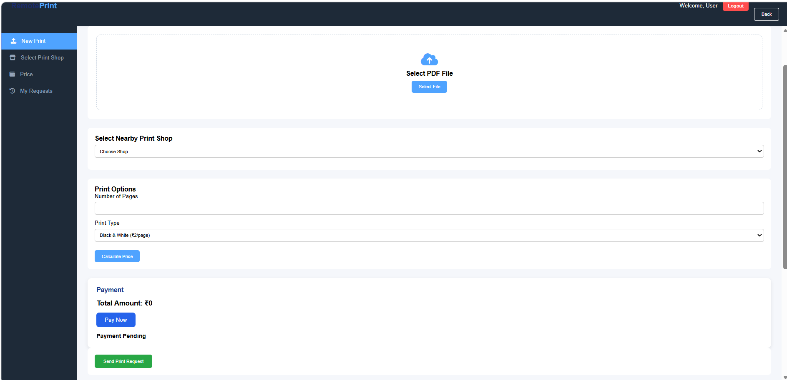
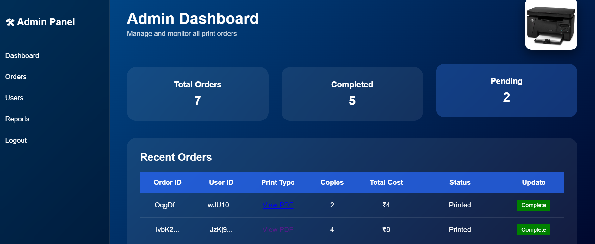
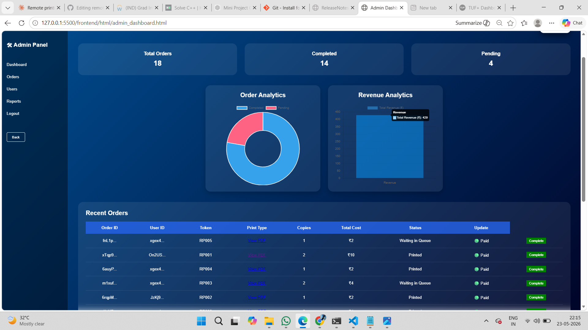
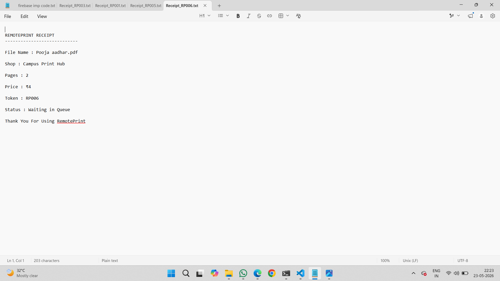
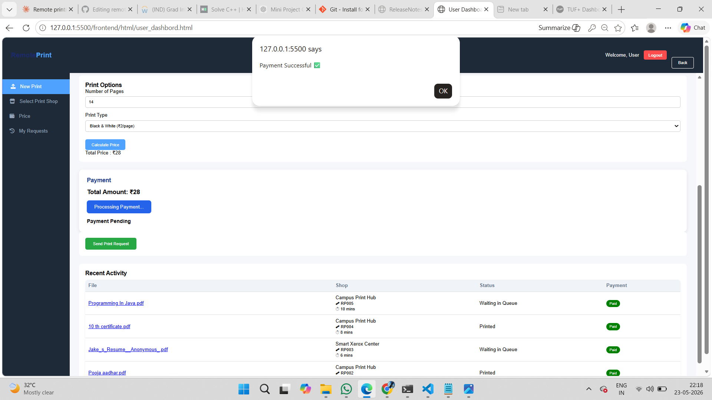
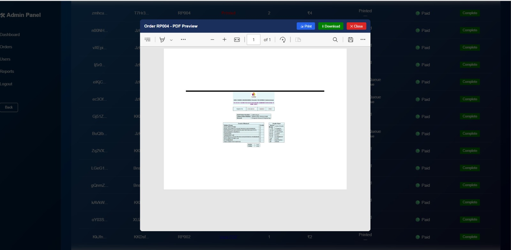

# 🖨️ Remote Printing System

A secure, real-time cloud-based printing platform where users can remotely 
upload documents, make payments, track print status, and collect printed 
documents from nearby print shops.

## 🚀 Features

- User Authentication using Firebase
- PDF Upload and Page Detection using PDF.js
- Dynamic Price Calculation based on page count
- Queue Management with Unique Token Generation
- Live Queue Position Tracking for Users
- Real-Time Print Status Updates using Firestore
- Admin Dashboard for Managing Print Requests
- Admin PDF Preview with Print and Download Options
- PDF Preview Modal with Print, Download, and Close Controls
- Admin Dashboard Analytics using Chart.js
- Cloudinary File Storage
- Payment Simulation
- Receipt Generation after Print Request
## 🖨️ Admin Print Workflow

1. Admin views incoming print requests from the Admin Dashboard.
2. Admin clicks the **View PDF / Print** option.
3. The uploaded PDF opens in a secure preview window.
4. Admin can preview all pages before printing.
5. Admin can choose **Print** to send the document for printing.
6. Admin can choose **Download** to download the PDF when required.
7. After successful printing, the admin marks the request as **Printed**.
8. The user's print status is updated in real time.

## ⏳ Queue Management

- Every print request is assigned a unique print token.
- Print requests are organized based on their queue order.
- Users can view their current queue position, such as `#7 in queue`.
- Queue positions update as earlier print requests are completed.
- Printed requests are removed from the active queue.

## 🛠️ Tech Stack
HTML | CSS | JavaScript | Firebase Auth | Firestore | Cloudinary | PDF.js | Chart.js

## 📸 Screenshots

### 👤 User Dashboard


### 🛠️ Admin Dashboard


### 📊 Analytics


### 🧾 Receipt Generation


### 💳 Payment Section


### 🖨️ Admin PDF Preview


## ⚙️ Setup Instructions

### 1️⃣ Clone the Repository
```bash
git clone https://github.com/Pooja-Naik7799/remote-printing-system.git
cd remote-printing-system
```

---

### 2️⃣ Configure Firebase

1. Go to [Firebase Console](https://console.firebase.google.com/)
2. Create a new project (or use existing)
3. Go to **Project Settings → General → Your Apps → Web App**
4. Copy your config and create `firebase-config.js`:

```javascript
import { initializeApp } from "firebase/app";

const firebaseConfig = {
  apiKey: "YOUR_API_KEY",
  authDomain: "YOUR_PROJECT_ID.firebaseapp.com",
  projectId: "YOUR_PROJECT_ID",
  storageBucket: "YOUR_PROJECT_ID.firebasestorage.app",
  messagingSenderId: "YOUR_MESSAGING_SENDER_ID",
  appId: "YOUR_APP_ID"
};

const app = initializeApp(firebaseConfig);
```


---

### 3️⃣ Configure Firestore Rules

Go to **Firebase Console → Firestore Database → Rules** and publish:

```javascript
rules_version = '2';
service cloud.firestore {
  match /databases/{database}/documents {

    match /users/{userId} {
      allow read, write: if request.auth != null
                         && request.auth.uid == userId;
    }

    match /printRequests/{docId} {
      allow create: if request.auth != null
                    && request.auth.uid == request.resource.data.userId;
      allow read, update: if request.auth != null
                          && request.auth.uid == resource.data.userId;
      allow read, write: if request.auth != null
                         && get(/databases/$(database)/documents/users/$(request.auth.uid)).data.role == "admin";
    }
  }
}
```

---

### 4️⃣ Configure Cloudinary

1. Go to [Cloudinary Console](https://cloudinary.com/)
2. Copy your **Cloud Name** from the dashboard
3. Go to **Settings → Upload → Add upload preset**
   - Set mode to **Unsigned**
   - Name it `remote_print_preset`
4. In `dashboard.js`, update:

```javascript
https://api.cloudinary.com/v1_1/YOUR_CLOUD_NAME/auto/upload
```

---

### 5️⃣ Run the Project

Open in **VS Code** and use the **Live Server** extension.
OR open `index.html` directly in your browser.

---

### 6️⃣ Admin Access Setup

1. Register a user via Firebase Authentication
2. In Firestore, manually create:
